<div align="center">



<br />

<a href="https://www.horizonsinsights.com/"></a>
<a href="mailto:herberth7777@gmail.com"></a>
<a href="https://github.com/Herberth7777"></a>

</div>

## `// system.identity`

```yaml
subject: Herberth Cunha
role: Software Engineer · ML/DL Specialist · Cloud, Big Data & AI Architect
location: Uberlândia, MG · Brasil
company: "@blips"
mission: Transformar dados, software e IA em sistemas que escalam com segurança.
principles: [engineering_first, measurable_impact, secure_by_design, finops_mindset]
status: ONLINE
```

Sou engenheiro de software e arquiteto de soluções na interseção entre **Inteligência Artificial, dados e cloud**. Projeto plataformas de alto impacto com uma visão ponta a ponta: do modelo e da arquitetura à operação segura, observável e financeiramente sustentável.

<div align="center">

| `01 · INTELLIGENCE` | `02 · PLATFORM` | `03 · SCALE` |
|:---:|:---:|:---:|
| Machine Learning & Deep Learning | Software, APIs & Big Data | Cloud, FinOps & CyberSec |
| Modelos que resolvem problemas reais | Arquiteturas claras e evolutivas | Performance com controle e segurança |

</div>

## `// core.toolchain`

<div align="center">


<br />


<br />


</div>

## `// live.signal`

<div align="center">


</div>

<picture>
  <source media="(prefers-color-scheme: dark)" srcset="https://raw.githubusercontent.com/Herberth7777/Herberth7777/output/github-contribution-grid-snake-dark.svg" />
  <source media="(prefers-color-scheme: light)" srcset="https://raw.githubusercontent.com/Herberth7777/Herberth7777/output/github-contribution-grid-snake.svg" />
  
</picture>

---

<div align="center">

`BUILD WITH INTELLIGENCE · SCALE WITH CONTROL · SHIP WITH PURPOSE`

<sub>Projetado em Uberlândia · transmitindo para o mundo</sub>

</div>
