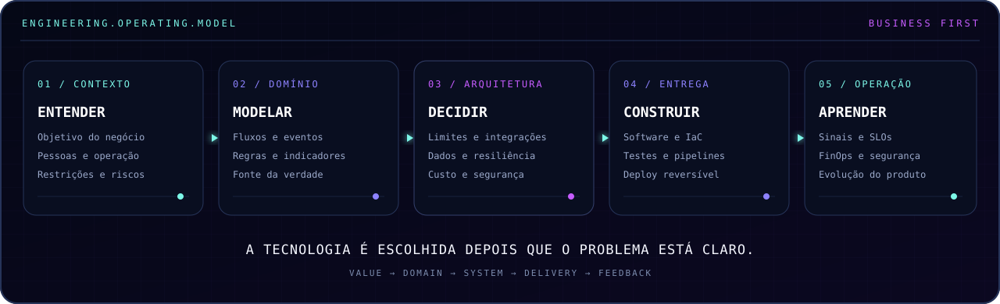

<div align="center">


<br />

<a href="https://www.horizonsinsights.com/"></a>
<a href="https://www.linkedin.com/in/herberth-cunha-4197a92b0/"></a>
<a href="mailto:herberth7777@gmail.com"></a>
<a href="https://github.com/Herberth7777/Herberth7777/blob/main/docs/portfolio-en.md"></a>

</div>

## `// business.first`

> **Eu não começo pelo framework. Começo pela decisão que o negócio precisa tomar, pelo processo que sustenta essa decisão e pelo problema que precisa deixar de existir.**

Sou engenheiro de software e arquiteto de soluções com atuação ponta a ponta: descoberta do problema, modelagem do domínio, arquitetura, implementação, cloud e operação. Meu trabalho conecta **negócio, software, dados e inteligência artificial** para construir sistemas úteis, explicáveis e sustentáveis.

Não considero uma plataforma bem-sucedida apenas porque está no ar. Ela precisa melhorar uma operação, reduzir incerteza, organizar uma fonte de verdade ou tornar uma decisão mais rápida e confiável.



## `// system.identity`

```yaml
subject: Herberth Cunha
role: Software Engineer · Cloud, Data & AI Architect
location: Uberlândia, MG · Brasil
company: "@blips"
focus: [business_modeling, software_architecture, terraform, aws, data, applied_ai]
principles: [business_first, secure_by_design, observable_by_default, finops_mindset]
mission: Transformar problemas reais em sistemas que escalam com propósito.
status: ONLINE
```

## `// selected.portfolio`

| Material | O que demonstra |
|---|---|
| **[Do problema à arquitetura](./docs/case-study-business-first.md)** | Estudo de caso anonimizado sobre descoberta, domínio, indicadores e desenho da solução |
| **[Cloud & Terraform](./docs/cloud-terraform.md)** | AWS, infraestrutura como código, segurança, observabilidade, entrega e FinOps |
| **[Engenharia de sistemas](./docs/systems-engineering.md)** | Linguagens, padrões arquiteturais, dados, mobile, IA, testes e operação |
| **[Engineering Portfolio — English](./docs/portfolio-en.md)** | Concise international version for recruiters and engineering leaders |

## `// experience.matrix`

| Frente | Experiência aplicada |
|---|---|
| **Negócio e produto** | Descoberta de processos, jornadas, regras, indicadores, restrições, prioridades e modelagem de domínio |
| **Backend e sistemas** | Python, Flask, APIs REST, serviços, workers, filas, integrações, idempotência e modo degradado |
| **Web e visualização** | TypeScript, JavaScript, React, Vite, Tailwind, Jinja2, dashboards e interfaces administrativas |
| **Mobile** | Dart e Flutter para Android, iOS, Web e desktop, consumo de APIs, câmera e persistência local |
| **Dados** | PostgreSQL, MySQL, SQLite, SQL Server, SQL/T-SQL, SQLAlchemy, JDBC e migrations com Alembic |
| **IA aplicada** | APIs de modelos, agentes com ferramentas, classificação de intenção, áudio, documentos e automações |
| **Cloud e IaC** | AWS, Terraform, Cloudflare, redes, compute, storage, serverless, mensageria e bancos gerenciados |
| **Entrega e operação** | Docker, GitHub Actions, testes, segurança de supply chain, observabilidade, runbooks e rollback |

## `// cloud.terraform`


Minha atuação em cloud inclui transformar requisitos de capacidade, segurança, custo e disponibilidade em infraestrutura versionada. Trabalho com Terraform separando rede, segurança, computação, dados, DNS e observabilidade, com contratos claros de variáveis e outputs.

O objetivo não é apenas provisionar recursos. É entregar uma arquitetura que o time consiga revisar, operar, medir e evoluir — com permissões mínimas, alarmes úteis, orçamento monitorado e caminho de rollback.

## `// verified.toolchain`

<div align="center">

### Linguagens


### Aplicações


### Dados e inteligência


### Cloud, IaC e entrega


</div>

## `// engineering.depth`

- arquitetura modular com domínio separado de rotas, telas e fornecedores;
- ADRs, documentação de arquitetura, contratos de deploy e runbooks;
- pipelines assíncronos com filas, workers, idempotência, retry e DLQ;
- migrations reversíveis e compatíveis com rollout gradual;
- containers multi-arquitetura, incluindo builds ARM64;
- CI com lint, testes, cobertura, banco real, auditoria de dependências e detecção de segredos;
- logs estruturados, request IDs, health checks, métricas e alarmes;
- IAM/OIDC, criptografia, menor privilégio e prevenção de segredos em artefatos;
- AWS Budgets, cache, lifecycle e dimensionamento orientado a FinOps;
- decisões de IA baseadas em valor, explicabilidade, dados e custo do erro.

<sub>Os materiais deste portfólio são sínteses sanitizadas de experiência real. Nomes de produtos, clientes, regras proprietárias, código-fonte, credenciais, URLs e detalhes operacionais foram deliberadamente omitidos.</sub>

## `// live.signal`

<div align="center">


</div>

<picture>
  <source media="(prefers-color-scheme: dark)" srcset="https://raw.githubusercontent.com/Herberth7777/Herberth7777/output/github-contribution-grid-snake-dark.svg" />
  <source media="(prefers-color-scheme: light)" srcset="https://raw.githubusercontent.com/Herberth7777/Herberth7777/output/github-contribution-grid-snake.svg" />
  
</picture>

---

<div align="center">

`UNDERSTAND THE BUSINESS · DESIGN THE SYSTEM · OPERATE THE OUTCOME`

<sub>Uberlândia, Brasil · disponível para conversas sobre engenharia, arquitetura e produtos digitais</sub>

</div>
