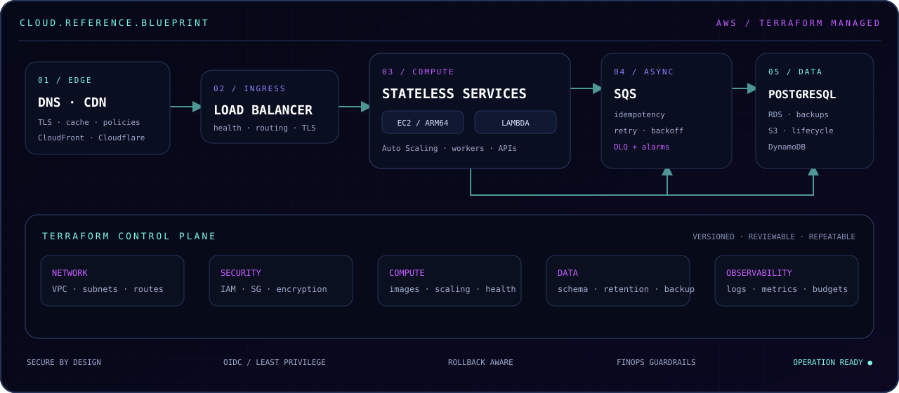

# Cloud & Terraform



## Infraestrutura como parte do produto

Trato infraestrutura como código versionado, revisável e conectado às necessidades da aplicação. Terraform não é apenas o mecanismo de criação dos recursos: é a forma de tornar decisões de rede, segurança, capacidade, observabilidade e custo explícitas para o time.

Minha experiência prática inclui AWS e Cloudflare, com organização de infraestrutura por responsabilidades:

| Camada | Experiência aplicada |
|---|---|
| Edge e entrega | DNS, TLS, CloudFront, políticas de cache e distribuição de conteúdo |
| Rede e acesso | VPC, sub-redes, rotas, Security Groups e desenho de entrada pública |
| Computação | EC2, imagens ARM64, Auto Scaling, Lambda e workloads stateless |
| Dados | PostgreSQL/RDS, S3, DynamoDB, versionamento, criptografia e lifecycle |
| Assíncrono | SQS, DLQ, workers, retries e processamento idempotente |
| Identidade | IAM, instance profiles, políticas mínimas e autenticação OIDC em pipelines |
| Operação | CloudWatch, logs estruturados, health checks, alarmes e runbooks |
| FinOps | AWS Budgets, alarmes de consumo, dimensionamento e análise de trade-offs |

## Como estruturo Terraform

Uma base de infraestrutura precisa ser simples de navegar. Costumo separar arquivos e responsabilidades em blocos como:

```text
infra/terraform/
├── versions.tf       # versões mínimas e providers
├── providers.tf      # região, autenticação e tags comuns
├── locals.tf         # convenções e composição de nomes
├── network.tf        # VPC, sub-redes, rotas e entrada
├── security.tf       # IAM, Security Groups e políticas
├── compute.tf        # instâncias, templates e scaling
├── data.tf           # persistência, buckets e retenção
├── monitoring.tf     # logs, métricas, alarmes e orçamento
├── dns.tf            # registros e certificados
├── variables.tf      # contrato de entrada
└── outputs.tf        # contrato de saída
```

Os princípios por trás dessa organização são mais importantes que os nomes dos arquivos:

- providers e versões são explícitos;
- recursos recebem tags consistentes;
- segredos não entram no estado por conveniência;
- entradas e saídas formam um contrato legível;
- regras de rede seguem menor privilégio;
- alarmes e orçamento nascem junto com o recurso;
- mudanças de infraestrutura passam pelo mesmo fluxo de revisão do software.

## Arquitetura orientada a restrições

Não existe “arquitetura cloud ideal” fora do contexto. Volume, equipe, orçamento, criticidade e capacidade de operação determinam o desenho.

Alguns trade-offs que considero:

- EC2 ou serviço gerenciado conforme controle necessário e custo total;
- ARM64 quando dependências, pipeline e observabilidade suportam a arquitetura;
- processamento assíncrono quando a escrita não precisa bloquear a jornada do usuário;
- CloudFront para retirar tráfego pesado do caminho da aplicação;
- banco dedicado ou compartilhado conforme isolamento, conexões e responsabilidade operacional;
- Lambda para tarefas limitadas e orientadas a evento, não como resposta automática a qualquer problema;
- escalabilidade horizontal somente depois de remover estado local e definir readiness real.

## Deploy e operação

Meu desenho de entrega considera o que acontece quando algo falha:

- imagem identificada pelo SHA do commit, nunca por uma tag ambígua;
- migração de schema executada por um único job antes do rollout;
- mudanças de banco compatíveis com versões antiga e nova durante a transição;
- liveness e readiness com responsabilidades diferentes;
- encerramento gracioso de processos e workers;
- rollback da aplicação e do schema pensado antes do deploy;
- logs estruturados, request ID e eventos de domínio úteis para investigação;
- alarmes sobre sintomas do usuário, filas, banco e custo.

## Segurança e FinOps como requisitos

Segurança e custo não ficam para uma etapa posterior. Em cloud, ambos são propriedades arquiteturais.

Eu trabalho com permissões mínimas, isolamento de rede, criptografia, bloqueio de acesso público, versionamento, rotação de segredos, scanning de dependências e prevenção de credenciais em imagens. Do lado de custo, uso orçamento, alarmes, lifecycle, cache e dimensionamento para evitar que a solução escale tecnicamente e falhe economicamente.

---

[← Voltar ao portfólio](../README.md) · [Estudo de caso](case-study-business-first.md) · [Engenharia de sistemas](systems-engineering.md)
